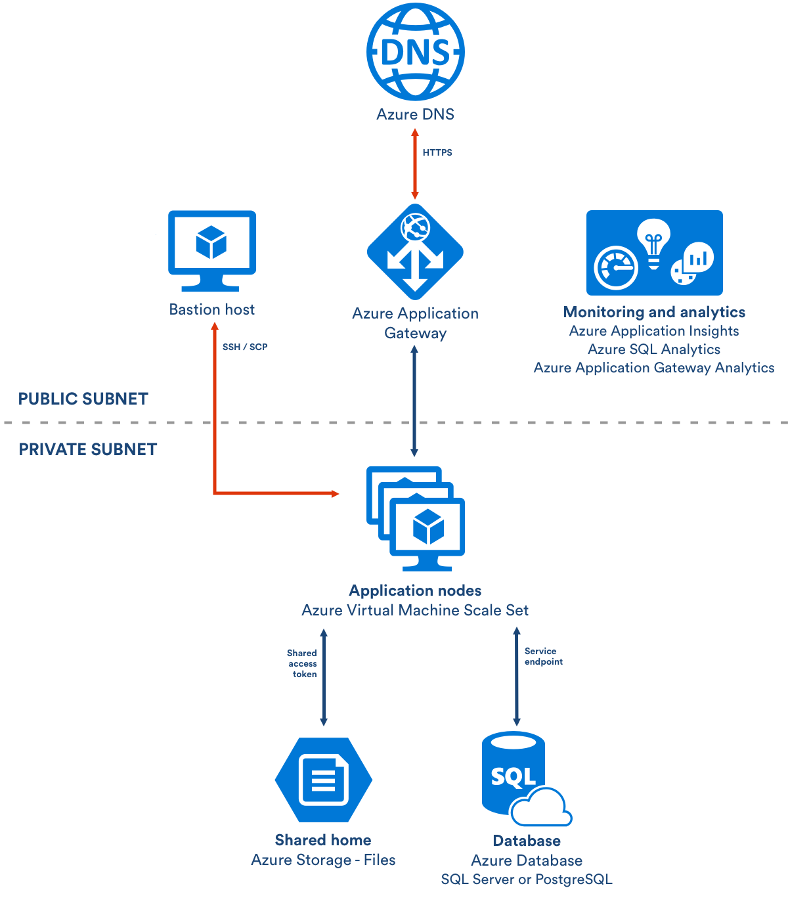

# Atlassian Data Center Azure Templates

## Purpose
This repository contains Azure ARM templates to install the following [Atlassian Data Center](https://www.atlassian.com/enterprise/data-center) products:  

1. [Bitbucket Data Center](https://www.atlassian.com/software/bitbucket/enterprise/data-center)  
2. [Confluence Data Center](https://www.atlassian.com/software/confluence/enterprise/data-center)  
3. [Crowd Software Data Center](https://www.atlassian.com/enterprise/data-center/crowd)  
4. [Jira Software Data Center](https://www.atlassian.com/enterprise/data-center/jira)  
5. [Jira Service Desk Data Center](https://www.atlassian.com/software/jira/service-desk/enterprise/data-center)  

## Status
[logo]: images/check_mark_32.png "OK"
[fail]: images/cross_mark_32.png "FAIL"

| Product               | Repo        | Marketplace |
|-----------------------|:-----------:|:-----------:|
| Bitbucket             | ![OK][logo] | ![OK][logo] |
| Confluence            | ![OK][logo] | ![OK][logo] |
| Crowd                 | ![OK][logo] | ![OK][logo] |
| Jira Software         | ![OK][logo] | ![OK][logo] |
| Jira Service Desk     | ![OK][logo] | ![OK][logo] |

## Release Notes
[Can be found here](RELEASE.md)

## Key Features
The templates in this repository use Azure Cloud features to create a resilient and saleable solution:  

*  Only Azure "managed" features/functionality used to provide scalability, monitoring, and backup/recovery features "out of the box."  
*  Security and accessibility principles/rules applied to ensure all customer data is protected.  
*  Optional SSL and CNAME/domain name support.  
*  Advanced monitoring and analytics the following integrated services:
    *  Azure Application Insights
    *  Azure Monitor
    *  Azure SQL Analytics
    *  Azure Gateway Analytics
*  Log collection/aggregation.  
*  Database flexibility:
    *  You can deploy an Azure SQL DB or Postgres database.  
    *  You can supply an existing Azure SQL DB or Postgres database.  
*  Integrated Azure Accelerated Networking for enhanced cluster performance.  
*  Recommended infrastructure/cluster sizing or fully configurable infrastructure options.
*  Configurable Linux OS options for Jumpbox/VMs (Ubuntu LTS 16.04/18.04, RHEL 7.5, Centos 7.5, Debian Stretch 9-backports )



For more information on the Atlassian Azure solution, features, install options, and FAQs, check out [Atlassian Azure Page](https://www.atlassian.com/enterprise/data-center/azure)  

## Installation through Azure Marketplace

Each Atlassian application folder contains specific instructions on how to deploy the individual application, so always check there first. You can also find (and deploy from) the same templates on the Azure Marketplace:

*  [Jira Software Data Center](https://azuremarketplace.microsoft.com/en-us/marketplace/apps/atlassian.jira-data-center)
*  [Jira Service Desk Data Center](https://azuremarketplace.microsoft.com/en-us/marketplace/apps/atlassian.jira-service-desk)
*  [Confluence Data Center](https://azuremarketplace.microsoft.com/en-us/marketplace/apps/atlassian.confluence-data-center)
*  [Crowd Data Center](https://azuremarketplace.microsoft.com/en-us/marketplace/apps/atlassian.crowd-data-center)
*  [Bitbucket Data Center](https://azuremarketplace.microsoft.com/en-us/marketplace/apps/atlassian.bbsdc)

When you deploy using these Azure Marketplace templates, many parameters will be pre-configured for your convenience.

## Installation through CLI

If you prefer a more customized deployment, you're welcome to use the templates in this repository directly. When you do, you'll need to deploy via the [Azure CLI](https://docs.microsoft.com/en-us/cli/azure/install-azure-cli?view=azure-cli-latest). Choose one of the following methods, depending on which tools you're comfortable with:

*  [Deploying via Azure CLI with Node and Gulp](DEVELOPING.md)
*  [Deploying via Azure CLI with AzCopy](DEVELOPING2.md)

Both methods contain recommendations for overriding default deployment configurations through a _custom parameters template_. You can review the `mainTemplate.json` file in each product directory to see what parameters you can override to customize your deployment.

### Jumpbox SSH Key configuration
Regardless of what you're installing, you'll *always* need to specify your _jumpbox SSH key_. Do this through the `sshKey` parameter. This will allow you to connect via SSH to the jumpbox/bastion node (and then onto the cluster nodes). This key is your device's SSH public key (normally found at `~/.ssh/id_rsa.pub`). Cut/paste this value into the `sshKey` parameter of your custom parameters template, like so:
```
    {
        "parameters": {
            "sshKey": {
                "value": "ssh-rsa AAAAo2D7KUiFoodDCJ4VhimXqG..."
            }
        }
    }
```

### Deployment customizations

Each set of product templates in this repository allows you to set more than just the jumpbox key. See [Deployment customizations](HOWTO.md) for more information.

## Contributors

Pull requests, issues and comments welcome. For pull requests:

* Add tests for new features and bug fixes
* Follow the existing style
* Separate unrelated changes into multiple pull requests

See the existing issues for things to start contributing.

For bigger changes, make sure you start a discussion first by creating
an issue and explaining the intended change.

Atlassian requires contributors to sign a Contributor License Agreement,
known as a CLA. This serves as a record stating that the contributor is
entitled to contribute the code/documentation/translation to the project
and is willing to have it used in distributions and derivative works
(or is willing to transfer ownership).

Prior to accepting your contributions we ask that you please follow the appropriate
link below to digitally sign the CLA. The Corporate CLA is for those who are
contributing as a member of an organization and the individual CLA is for
those contributing as an individual.

* [CLA for corporate contributors](https://na2.docusign.net/Member/PowerFormSigning.aspx?PowerFormId=e1c17c66-ca4d-4aab-a953-2c231af4a20b)
* [CLA for individuals](https://na2.docusign.net/Member/PowerFormSigning.aspx?PowerFormId=3f94fbdc-2fbe-46ac-b14c-5d152700ae5d)
